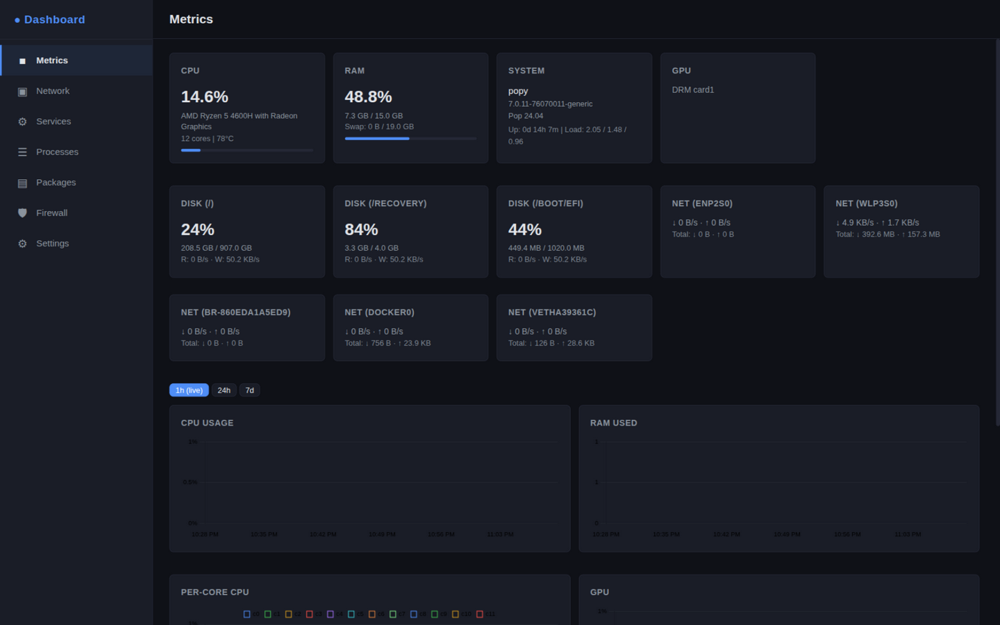
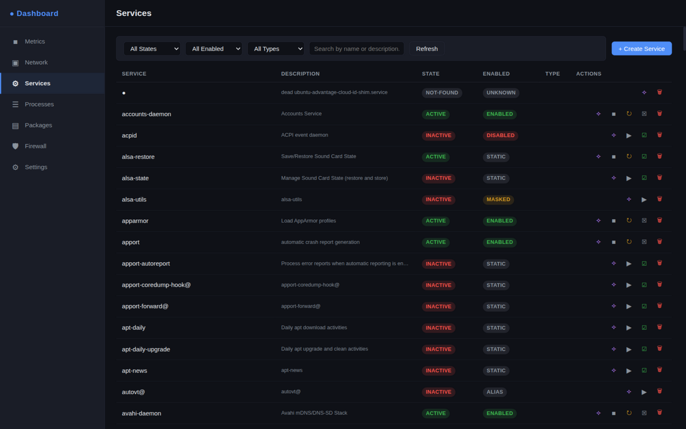
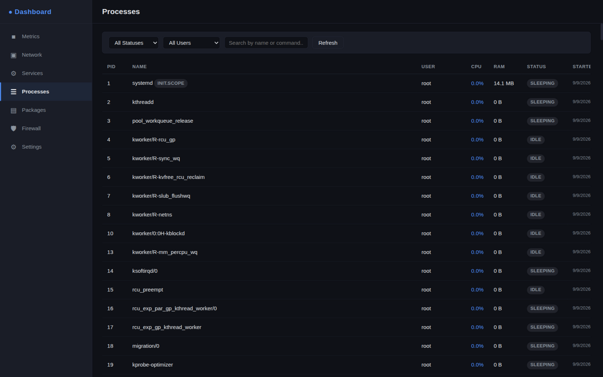
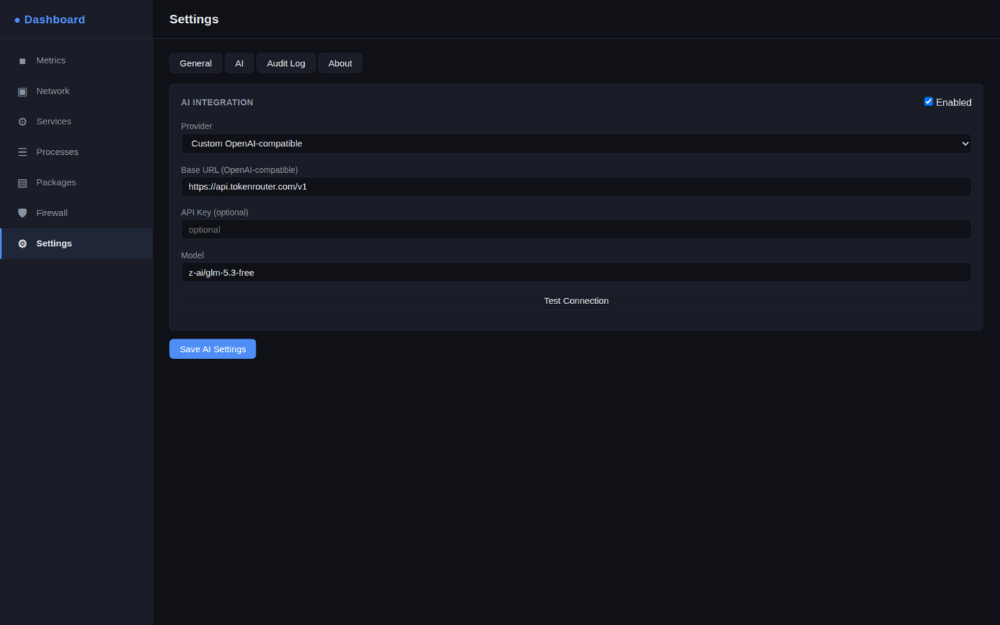
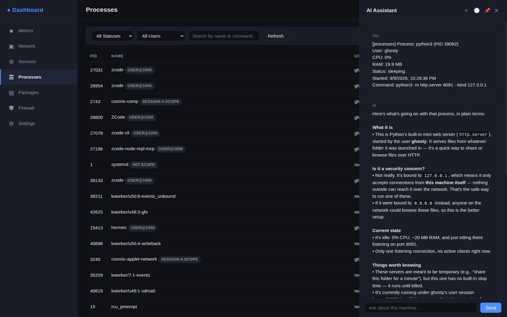

<div align="center">

# 🖥️ Linux Control Dashboard

**A self-hosted web dashboard for full visibility and control over your Linux machine — built for humans, not sysadmins.**

[](https://python.org)
[](https://fastapi.tiangolo.com)
[](LICENSE)
[](#)

</div>

---

## 📸 Screenshots

<table>
  <tr>
    <td align="center" width="50%">
      
      <sub><b>System Metrics</b> — Live CPU, RAM, Disk & Network graphs</sub>
    </td>
    <td align="center" width="50%">
      
      <sub><b>systemd Services</b> — Full control with status badges</sub>
    </td>
  </tr>
  <tr>
    <td align="center" width="50%">
      
      <sub><b>Processes</b> — Filter by user, status, CPU & RAM usage</sub>
    </td>
    <td align="center" width="50%">
      
      <sub><b>Settings</b> — AI provider setup, section toggles, bind config</sub>
    </td>
  </tr>
</table>

---

## ✨ Features

| Section | What you get |
|---|---|
| **📊 System Metrics** | Live CPU per-core, RAM, swap, disk I/O, network I/O, GPU — with persistent history (1h live / 24h / 7d views, SQLite-backed) |
| **🌐 Network & Ports** | All active connections, port states, owning service badges, auto IP resolution, persistent IP log |
| **⚙️ systemd Services** | Start / stop / restart / enable / disable / create / edit / delete — with `systemd-analyze verify` on every save, templates, and live process lists |
| **🔄 Processes** | Filterable process table with owning-service links, kill or stop, detailed per-process info |
| **📦 Packages** | Installed packages across apt / pacman / dnf / snap / flatpak, **search + install + remove**, an **Updates page**, and dependency links |
| **🔥 Firewall** | UFW and iptables rule builder with validated forms, quick-rule presets, real command preview, and rule persistence |
| **🤖 AI Assistant** (optional) | One chat panel with saved threads and long-term memory — it can *search* your machine (processes, services, logs, packages, firewall) and *propose* actions you approve with one click. Never executes anything on its own |
| **🔗 Cross-links** | Process ↔ service ↔ network connection navigation throughout the dashboard |
| **📋 Audit Log** | Every action tracked with timestamp, target, and result (capped & rotated) |
| **🔐 Authentication** | JWT login, bcrypt hashing, login rate limiting & lockout |

> **AI is an add-on, never a requirement.** Every feature above works fully with AI disabled.

---

## 🚀 Quick Install

```bash
git clone https://github.com/ghostspidy227/linux-dashboard.git
cd linux-dashboard
sudo bash install.sh
```

The install script will:

1. Detect your distro — supports **Ubuntu/Debian**, **Fedora/RHEL**, **Arch Linux**
2. Install required system tools (`python3`, `whois`, `nmap`, `dnsutils`, etc.)
3. Set up a Python virtual environment
4. Ask for bind address — **localhost only** or **LAN accessible**
5. Set your admin password
6. Register and start a `systemd` service
7. Print your access URL

Then open your browser at `http://127.0.0.1:7000` and log in.

---

## 🔧 Manual Install

If the install script doesn't cover your distro:

```bash
# Install system dependencies (adapt to your package manager)
sudo apt install python3 python3-pip python3-venv whois dnsutils iproute2 nmap

# Clone and set up
git clone https://github.com/ghostspidy227/linux-dashboard.git
cd linux-dashboard
python3 -m venv venv
venv/bin/pip install -r requirements.txt

# Copy example config
cp data/config.example.json data/config.json

# Run (must be root for full system access)
sudo venv/bin/python backend/main.py
```

---

## 🛠️ Managing the Service

```bash
sudo systemctl start linux-dashboard
sudo systemctl stop linux-dashboard
sudo systemctl restart linux-dashboard
sudo systemctl status linux-dashboard
journalctl -u linux-dashboard -f      # live logs
sudo bash /opt/linux-dashboard/uninstall.sh   # removes the app, keeps a data backup
```

---

## 🧪 Development

```bash
python3 -m venv venv
venv/bin/pip install -r requirements.txt pytest
venv/bin/pytest tests/ -q        # smoke tests (firewall validation, AI tool parsing, services)
venv/bin/python backend/main.py  # run directly
```

---

## 🤖 AI Providers

Enable the AI assistant in **Settings → AI** and pick a provider:

| Provider | Notes |
|---|---|
| **Ollama** | 100% local — install [Ollama](https://ollama.com), pull any model |
| **Gemini** | [Free API key](https://aistudio.google.com) available |
| **OpenAI** | [API key](https://platform.openai.com) required |
| **OpenRouter** | Access 100+ models with one [API key](https://openrouter.ai) |
| **Custom** | Any OpenAI-compatible endpoint — LM Studio, vLLM, LocalAI, etc. |

Once enabled, every table row gets an **✦ Ask AI** button — attach anything to the chat. The assistant can search your machine with read-only tools, and when you ask for a change it drafts an **Approve card** (firewall rule, service action, package install, process kill). Nothing runs until you click Approve. Chats are saved as threads you can resume, and the AI keeps long-term facts about your machine (view and manage them in the 📌 panel).



---

## 🌐 Remote Access

The dashboard binds to `localhost` by default and is only reachable on the machine it runs on. For remote access:

1. Set up a VPN — [Tailscale](https://tailscale.com), WireGuard, or ZeroTier are all great options
2. In **Settings → General**, switch bind to `LAN (0.0.0.0)`
3. Access via your VPN IP: `http://<vpn-ip>:7000`

> ⚠️ **Do NOT expose this dashboard directly to the public internet.** It has root-level control over your machine.

A simple and free option: [Tailscale](https://tailscale.com) — install it on both machines, `tailscale up`, done.

---

## 🏗️ Tech Stack

| Layer | Choice |
|---|---|
| Backend | Python + FastAPI |
| Frontend | Vanilla JS + HTML + CSS (no build step) |
| Real-time | WebSockets (token-authenticated) — metrics pushed every 5 seconds |
| Storage | JSON files (config, audit, IP log, AI threads/facts) + SQLite (metrics history) |
| Auth | JWT tokens + bcrypt + login rate limiting |

---

## 📄 License

MIT — do whatever you want with it.
